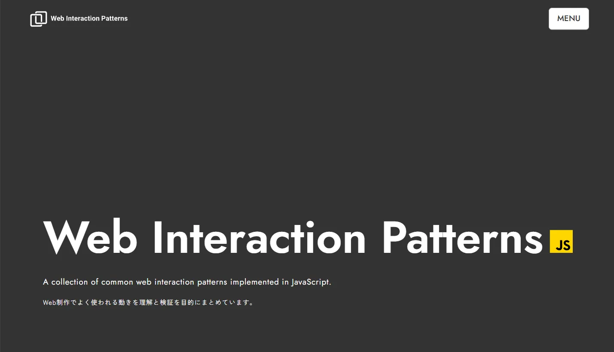

# 🧩 Web Interaction Patterns – Web Coding Demo（デモサイト）



## 🔗 Demo

（Demo Site URL）
[https://web-interaction-patterns.omiportfolio.com/](https://web-interaction-patterns.omiportfolio.com/)

&nbsp;

## 📝 Overview（概要）

製作期間：約 2 週間 (2026 年 1 月)

**Web制作で頻出するインタラクションの実装を、理解と検証を目的としてまとめたデモサイト**です。
**JavaScriptをメインに使用**し、HamburgerMenu・TabMenu・AccordionなどWeb制作では欠かせない機能をセクションに分けて実装しています。
また**GSAPやSplideの定番のライブラリも活用**し、心地よいアニメーションを導入することで操作性の向上を図るよう努めています。

【各セクションの内容】

- Modal
- Dropdown Menu
- Tab Menu
- Accordion
- Hamburger Menu
- Sticky Header
- Sticky CTA
- Infinity Slider

各セクションに関する詳細な仕様は**実際のデモサイトをご覧ください。**

&nbsp;

## 🛠️ Tech Stack（使用技術）

<p align="left">


</p>

&nbsp;

## ✨ Features（制作ポイント）

### 1. 実際のサイト構築に欠かせない定番のUIを実装

- どのUIもWeb制作でよく実装されるものですが、定番だからこそ非常に重要なパーツです。**GSAP等のライブラリを用いる事でリッチかつユーザーにとって心地よいアニメーションを実現**しています。

### 2. ローディングアニメーションを導入

- シンプルなサイト構成に見合う様に控え目なアニメーションですが、タイポグラフィを活用し遊び心も取り入れました。


### 3. サイト構成＆オリジナルデザイン

- 今回、サイトの構成からデザイン・実装まで担当しています。


### 4. JSライブラリ**SplideのAutoScrollを使用**したスライダーの設置

- Infinity Sliderを実装しました。クリックするとスライドが反転します。実際の現場ではあまり見られない実装かもしれませんが、実験・検証を目的としたサイトとして挑戦しています。
  

  &nbsp;

## 📂 Directory（主な構成）

```text
.
├── about.html
├── contact.html
├── index.html
├── news.html
├── recruit.html
├── service.html
├── css
│   ├── style.css
│   ├── style.css.map
│   └── vendor
│       └── splide-core.min.css
├── img
├── js
│   ├── component
│   │   ├── hamburger-menu.js
│   │   ├── header-background-toggle.js
│   │   └── scroll-animations.js
│   ├── main.js
│   ├── slider
│   │   ├── gallery-slider.js
│   │   └── staff-slider.js
│   └── vendor
│       ├── gsap.min.js
│       ├── ScrollTrigger.min.js
│       ├── splide-extension-auto-scroll.min.js
│       └── splide.min.js
└── scss
    ├── component
    │   ├── _breadcrumb.scss
    │   ├── _button.scss
    │   ├── _entry-button.scss
    │   ├── _form.scss
    │   ├── _index.scss
    │   ├── _news-item.scss
    │   ├── _page-kv.scss
    │   ├── _pagination.scss
    │   └── _title.scss
    ├── foundation
    │   ├── _base.scss
    │   ├── _index.scss
    │   └── _reset.scss
    ├── global
    │   ├── _breakpoints.scss
    │   ├── _color.scss
    │   ├── _font.scss
    │   ├── _index.scss
    │   └── _z-index.scss
    ├── layout
    │   ├── _container.scss
    │   ├── _footer.scss
    │   ├── _header.scss
    │   └── _index.scss
    ├── page
    │   ├── _index.scss
    │   ├── about
    │   │   ├── _about-company.scss
    │   │   ├── _about-philosophy.scss
    │   │   └── _about-staff.scss
    │   ├── contact
    │   │   └── _contact-form.scss
    │   ├── news
    │   │   └── _news-archive.scss
    │   ├── recruit
    │   │   ├── _recruit-benefit.scss
    │   │   ├── _recruit-culture.scss
    │   │   └── _recruit-position.scss
    │   ├── service
    │   │   ├── _service-case.scss
    │   │   └── _service-detail.scss
    │   └── top
    │       ├── _top-about.scss
    │       ├── _top-kv.scss
    │       ├── _top-news.scss
    │       ├── _top-recruit.scss
    │       └── _top-service.scss
    ├── style.scss
    └── utility
        ├── _index.scss
        └── _utility.scss

```

## 💻 Development Environment（開発環境）

- Cursor
- SCSS / Live Sass Compiler
- Live Server

&nbsp;

## ⚠️ Notes（注意事項）

- 本サイトは学習目的で制作したデモサイトです。

&nbsp;
